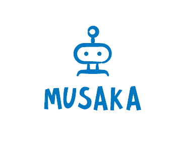

<h1 align="center"> TEAM Musaka <h1>

 

 

## 📋 Table of contents
  - [Description](#description)
  - [Documentation](#docs)
  - [Technologies](#technologies)
  - [Collaborators](#collaborators)
  
## 🔍 Description 

 This is a site about the future the past and the present of robotics. 

  
## 📃 Documentation 
  
## [Team documentation](https://github.com/AZGeorgiev22/musaka/raw/main/docs/Musaka-team%20documentation.docx)
  
## [Presentation](https://github.com/AZGeorgiev22/musaka/raw/main/docs/Musaka.pptx)

## 🖥️ Technologies used  
  

## 🧑 Collaborators 
- [Asparuh Georgiev](https://github.com/AZGeorgiev22) - Scrum trainer 
- [Georgi Stoyanov](https://github.com/GSStoyanov22) - Back-end Developer
- [Maxim Mateev](https://github.com/MPMateev22) - Back-end Developer
- [Stefan Ivanov](https://github.com/SBIvanov22) - Designer
